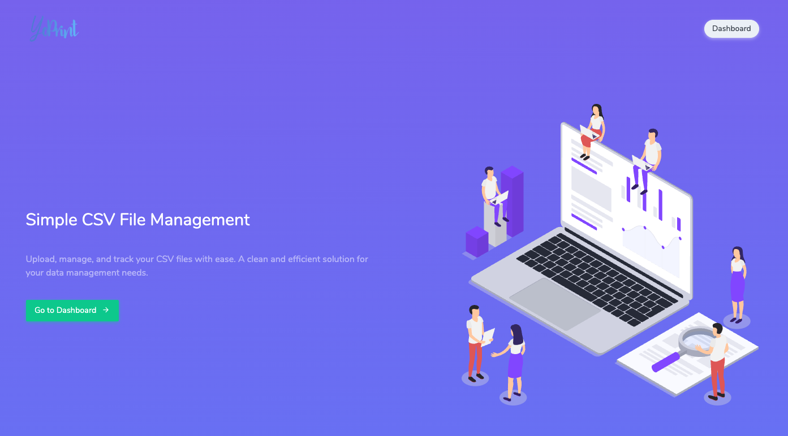

#  CSV Upload and Management System

A Laravel-based CSV file upload and management system with background processing, admin dashboard, and role-based access control.


## 📸 Screenshots

### User Dashboard

*CSV file upload interface with status tracking and file management*

### Admin Dashboard

*Comprehensive admin dashboard with processing statistics and queue management*

### Login Page

*Clean authentication interface with YoPrint branding and gradient header*

---

## 📋 Table of Contents

- [Overview](#overview)
- [Features](#features)
- [Tech Stack](#tech-stack)
- [Installation](#installation)
- [Configuration](#configuration)
- [Database Setup](#database-setup)
- [Usage](#usage)
- [System Architecture](#system-architecture)
- [Admin Features](#admin-features)
- [Screenshots](#screenshots)
- [Troubleshooting](#troubleshooting)
- [Commands Reference](#commands-reference)
- [Deployment](#deployment)
- [Contributing](#contributing)
- [License](#license)

## 🎯 Overview

YoPrint is a comprehensive CSV file management system built with Laravel 11 that allows users to upload CSV files for background processing. The system features role-based access control, with separate interfaces for regular users and administrators.

### Key Highlights

- **Background Processing**: CSV files are processed asynchronously using Laravel's queue system
- **UPSERT Logic**: Intelligent data insertion/update based on unique keys
- **UTF-8 Cleaning**: Automatic removal of non-UTF-8 characters from CSV data
- **Idempotent Uploads**: Same file can be uploaded multiple times without creating duplicates
- **Admin Dashboard**: Comprehensive monitoring and management interface
- **Role-Based Access**: Separate permissions for users and administrators

## ✨ Features

### User Features

- ✅ CSV file upload with validation (max 10MB)
- ✅ Real-time upload status tracking (Pending, Processing, Completed, Failed)
- ✅ File management dashboard with filtering options
- ✅ Download processed files
- ✅ Delete uploaded files
- ✅ Profile management (update name, email, password)

### Admin Features

- 👨‍💼 Processing dashboard with statistics
- 📊 Total uploads, pending, processing, completed, failed counts
- 🔄 Reprocess failed uploads
- ✅ Mark uploads as completed manually
- 📁 View detailed processing information
- 🗃️ Browse all CSV data records
- 🔍 Search functionality for CSV data
- 🗑️ Delete uploads and data

### Technical Features

- 🔐 Authentication system with login/register
- 🎨 Modern UI with Hyper Bootstrap template
- 🌓 Gradient header design with YoPrint branding
- 📱 Responsive design
- 🔄 Background job processing with retry mechanism
- 📈 Processing statistics and error tracking
- 🛡️ Middleware-based authorization
- 🔧 UTF-8 character cleaning
- 💾 UPSERT database operations

## 🛠️ Tech Stack

- **Framework**: Laravel 11.x
- **PHP**: 8.2+
- **Database**: MySQL 8.0+
- **Frontend**: Bootstrap 5 (Hyper Template)
- **Queue Driver**: Database
- **Assets**: Vite
- **Icons**: Material Design Icons, Unicons

## 📦 Installation

### Prerequisites

Before you begin, ensure you have the following installed:

- PHP >= 8.2
- Composer
- MySQL >= 8.0
- Node.js & NPM (for asset compilation)
- Git

### Step 1: Clone the Repository

```bash
git clone https://github.com/yourusername/yocsv.git
cd yocsv
```

### Step 2: Install Dependencies

```bash
# Install PHP dependencies
composer install

# Install NPM dependencies
npm install
```

### Step 3: Environment Configuration

```bash
# Copy the environment file
cp .env.example .env

# Generate application key
php artisan key:generate
```

### Step 4: Configure Database

Edit your `.env` file with your database credentials:

```env
APP_NAME=YoPrint
APP_ENV=local
APP_KEY=base64:your-generated-key-here
APP_DEBUG=true
APP_URL=http://localhost

DB_CONNECTION=mysql
DB_HOST=127.0.0.1
DB_PORT=3306
DB_DATABASE=yocsv
DB_USERNAME=your_database_username
DB_PASSWORD=your_database_password

QUEUE_CONNECTION=database
```

### Step 5: Create Database

```bash
# Login to MySQL
mysql -u root -p

# Create database
CREATE DATABASE yocsv CHARACTER SET utf8mb4 COLLATE utf8mb4_unicode_ci;
EXIT;
```

### Step 6: Run Migrations

```bash
php artisan migrate
```

This will create the following tables:
- `users` - User accounts with admin flag
- `csv_uploads` - CSV file tracking and processing status
- `csv_data` - Parsed CSV data records
- `jobs` - Queue jobs table
- `failed_jobs` - Failed job tracking
- `password_reset_tokens` - Password reset tokens
- `sessions` - User sessions

### Step 7: Create Storage Link

```bash
php artisan storage:link
```

### Step 8: Compile Assets

```bash
# Development
npm run dev

# Production
npm run build
```

### Step 9: Create Admin User

Create your first admin user by running:

```bash
php artisan tinker
```

Then in the tinker console:

```php
$user = new App\Models\User();
$user->name = 'Admin User';
$user->email = 'admin@yoprint.com';
$user->password = bcrypt('password');
$user->is_admin = true;
$user->save();
exit
```

### Step 10: Start Queue Worker

**⚠️ IMPORTANT**: In a separate terminal, start the queue worker:

```bash
php artisan queue:work --tries=3 --timeout=300
```

> **Keep this running to process CSV files in the background**

### Step 11: Start Development Server

```bash
php artisan serve
```

Visit `http://localhost:8000` in your browser.

## ⚙️ Configuration

### Queue Configuration

The application uses database-based queues. Configuration is in `config/queue.php`:

```php
'default' => env('QUEUE_CONNECTION', 'database'),
```

### File Upload Limits

Upload limits are configured in the validation rules (`app/Http/Controllers/CsvUploadController.php`):

```php
'csv_file' => 'required|file|mimetypes:text/plain,text/csv,application/csv,text/comma-separated-values,application/vnd.ms-excel|max:10240',
```

Maximum file size: **10MB** (10240 KB)

### Supported MIME Types

- `text/plain`
- `text/csv`
- `application/csv`
- `text/comma-separated-values`
- `application/vnd.ms-excel`

## 🗄️ Database Setup

### Database Schema

#### Users Table
```sql
- id (bigint, primary key)
- name (string)
- email (string, unique)
- email_verified_at (timestamp, nullable)
- password (string)
- is_admin (boolean, default: false)
- remember_token (string, nullable)
- created_at (timestamp)
- updated_at (timestamp)
```

#### CSV Uploads Table
```sql
- id (bigint, primary key)
- user_id (bigint, foreign key -> users.id)
- file_name (string)
- status (enum: pending, processing, completed, failed)
- total_rows (integer, nullable)
- inserted_rows (integer, default: 0)
- updated_rows (integer, default: 0)
- error_rows (integer, default: 0)
- error_messages (text, nullable)
- created_at (timestamp)
- updated_at (timestamp)
```

#### CSV Data Table
```sql
- id (bigint, primary key)
- unique_key (string, unique, indexed)
- product_title (string, nullable)
- product_description (string, nullable)
- style (string, nullable)
- sanmar_mainframe_color (string, nullable)
- size (string, nullable)
- color_name (string, nullable)
- piece_price (string, nullable)
- created_at (timestamp)
- updated_at (timestamp)
```

### Migration Files

1. `2014_10_12_000000_create_users_table.php`
2. `2014_10_12_100000_create_password_reset_tokens_table.php`
3. `2019_08_19_000000_create_failed_jobs_table.php`
4. `2019_12_14_000001_create_personal_access_tokens_table.php`
5. `2024_01_01_000000_create_sessions_table.php`
6. `2024_01_01_000000_create_jobs_table.php`
7. `2025_11_21_132143_create_csv_uploads_table.php`
8. `2025_11_21_174907_create_csv_data_table.php`
9. `2025_11_21_175043_add_processing_fields_to_csv_uploads_table.php`
10. `2025_11_21_195240_add_is_admin_to_users_table.php`

## 📖 Usage

### For Regular Users

1. **Register/Login**
   - Navigate to `/register` to create a new account
   - Or login at `/login` if you already have an account

2. **Upload CSV File**
   - After login, you'll be redirected to `/csv`
   - Click "Choose file" and select your CSV file
   - Click "Upload File" button
   - File will be queued for background processing

3. **Monitor Upload Status**
   - View all your uploads on the dashboard
   - Filter by status: All, Pending, Processing, Completed, Failed
   - See processing statistics (total rows, inserted, updated, errors)

4. **Download/Delete Files**
   - Click download icon to download the original file
   - Click delete icon to remove the upload

5. **Profile Management**
   - Navigate to `/profile`
   - Update your name and email
   - Change your password
   - Delete your account (if needed)

### For Administrators

1. **Access Admin Dashboard**
   - Login with an admin account
   - Navigate to `/admin/csv`

2. **View Processing Dashboard**
   - See statistics for all uploads across all users
   - Monitor total uploads, pending, processing, completed, failed counts
   - View total CSV data records imported

3. **Manage Uploads**
   - View all user uploads
   - See detailed processing information
   - Reprocess failed uploads
   - Mark uploads as completed manually
   - Delete problematic uploads

4. **Browse CSV Data**
   - Navigate to `/admin/csv-data`
   - Search through all imported CSV records
   - View data in paginated table format

## 🏗️ System Architecture

### File Upload Flow

```
User uploads CSV file
       ↓
File saved to storage/app/public/csv_uploads/
       ↓
CsvUpload record created (status: pending)
       ↓
ProcessCsvFile job dispatched to queue
       ↓
Queue worker picks up job
       ↓
CsvParserService processes file
       ↓
Status updated: processing
       ↓
Parse CSV rows → Clean UTF-8 → UPSERT to database
       ↓
Status updated: completed/failed
       ↓
Statistics saved (total_rows, inserted_rows, updated_rows, error_rows)
```

### UPSERT Logic

The system uses intelligent UPSERT (Update or Insert) logic based on the `UNIQUE_KEY` column:

```php
// Check if record exists
$existing = CsvData::where('unique_key', $rowData['unique_key'])->first();

if ($existing) {
    // Update existing record
    $existing->update($rowData);
    $stats['updated']++;
} else {
    // Insert new record
    CsvData::create($rowData);
    $stats['inserted']++;
}
```

This ensures that:
- Re-uploading the same file updates existing records instead of creating duplicates
- The system is idempotent - multiple uploads of the same data produce the same result

### UTF-8 Character Cleaning

All CSV data is cleaned to remove non-UTF-8 characters before insertion:

```php
private function cleanUtf8(string $string): string
{
    // Convert encoding to UTF-8
    $string = mb_convert_encoding($string, 'UTF-8', 'UTF-8');

    // Remove control characters except newlines and tabs
    $string = preg_replace('/[\x00-\x08\x0B\x0C\x0E-\x1F\x7F]/u', '', $string);

    return $string;
}
```

### Background Job Processing

Jobs are configured with:
- **Queue**: default
- **Timeout**: 300 seconds (5 minutes)
- **Tries**: 3 attempts
- **Retry After**: 310 seconds

```php
public $timeout = 300;
public $tries = 3;
```

## 🔐 Authentication & Authorization

### Middleware

The application uses two main middleware groups:

1. **auth**: Requires user to be logged in
2. **admin**: Requires user to be logged in AND have `is_admin = true`

### Admin Middleware

Located at `app/Http/Middleware/IsAdmin.php`:

```php
public function handle(Request $request, Closure $next): Response
{
    if (!auth()->check() || !auth()->user()->is_admin) {
        abort(403, 'Unauthorized action.');
    }

    return $next($request);
}
```

### Protected Routes

```php
// User routes (requires auth)
Route::middleware('auth')->group(function () {
    Route::get('/csv', [CsvUploadController::class, 'index'])->name('csv.index');
    Route::post('/csv', [CsvUploadController::class, 'store'])->name('csv.store');
    Route::delete('/csv/{csvUpload}', [CsvUploadController::class, 'destroy'])->name('csv.destroy');
});

// Admin routes (requires auth + admin)
Route::prefix('admin')->name('admin.')->middleware(['auth', 'admin'])->group(function () {
    Route::get('/csv', [CsvAdminController::class, 'index'])->name('csv.index');
    Route::get('/csv/{csvUpload}', [CsvAdminController::class, 'show'])->name('csv.show');
    Route::post('/csv/{csvUpload}/reprocess', [CsvAdminController::class, 'reprocess'])->name('csv.reprocess');
    Route::post('/csv/{csvUpload}/mark-completed', [CsvAdminController::class, 'markCompleted'])->name('csv.markCompleted');
    Route::delete('/csv/{csvUpload}', [CsvAdminController::class, 'destroy'])->name('csv.destroy');
    Route::get('/csv-data', [CsvAdminController::class, 'data'])->name('csv.data');
});
```

## 🎨 Admin Features

### Processing Dashboard

Access: `/admin/csv`

**Statistics Cards:**
- Total Uploads
- Pending
- Processing
- Completed
- Failed
- Total CSV Records

**Processing Queue Table:**
- User name
- File name
- Status badge
- Upload date
- Statistics (Total/Inserted/Updated/Errors)
- Actions (View Details, Mark Completed, Reprocess, Delete)

### CSV Data Records

Access: `/admin/csv-data`

**Features:**
- Search functionality
- Paginated results
- Display all imported CSV data
- Column headers: Unique Key, Product Title, Description, Style, Color, Size, Price

### Admin Actions

#### Reprocess Upload
```php
POST /admin/csv/{csvUpload}/reprocess
```
Dispatches a new background job to reprocess the CSV file.

#### Mark as Completed
```php
POST /admin/csv/{csvUpload}/mark-completed
```
Manually marks an upload as completed (useful for stuck jobs).

#### Delete Upload
```php
DELETE /admin/csv/{csvUpload}
```
Deletes the upload record and associated file.

## 📸 Screenshots

### User Dashboard - CSV File Management


The user dashboard provides a clean interface for CSV file upload and management:
- **Upload Form**: Integrated file upload with choose file button
- **Status Filters**: Quick filter buttons for All, Pending, Processing, Completed, Failed
- **File Table**: Displays file name, status badges, upload date, and processing statistics
- **Actions**: Download and delete icons for each file
- **Statistics**: Shows total rows, inserted rows, updated rows, and error counts

### Admin Dashboard - Processing Queue


The admin dashboard offers comprehensive monitoring and control:
- **Statistics Cards**: 6 metric cards showing total uploads, pending, processing, completed, failed, and total CSV records
- **Processing Queue Table**: Lists all user uploads with detailed information
- **User Information**: Shows which user uploaded each file
- **Processing Stats**: Displays total/inserted/updated/error counts for each upload
- **Admin Actions**: View details, reprocess, mark completed, and delete buttons
- **Status Badges**: Color-coded status indicators (yellow for pending, blue for processing, green for completed, red for failed)

### Login Page - Authentication


Clean and modern authentication interface:
- **Gradient Header**: Purple gradient background with YoPrint logo
- **Centered Card Design**: Professional card layout with white background
- **Form Fields**: Email and password inputs with validation
- **Remember Me**: Checkbox option for persistent login
- **Password Toggle**: Eye icon to show/hide password
- **Forgot Password**: Link to password recovery
- **Registration Link**: Easy access to sign-up page

### Additional Features
- **Profile Settings**: Modern profile management with sections for personal info, password update, and account deletion
- **CSV Data Browser**: Admin interface to search and view all imported CSV records
- **Landing Page**: Hero section with YoPrint branding and call-to-action buttons


## 🤝 Contributing

Contributions are welcome! Please follow these steps:

1. Fork the repository
2. Create a feature branch: `git checkout -b feature/your-feature-name`
3. Commit your changes: `git commit -am 'Add new feature'`
4. Push to the branch: `git push origin feature/your-feature-name`
5. Submit a pull request

### Coding Standards

- Follow PSR-12 coding standard
- Use meaningful variable and function names
- Add comments for complex logic
- Write descriptive commit messages

## 📄 License

This project is licensed under the MIT License.

## 👥 Authors

- Initial development and implementation

## 🙏 Acknowledgments

- [Laravel](https://laravel.com/) - The PHP framework
- [Hyper Template](https://coderthemes.com/hyper/) - Bootstrap admin template
- [Bootstrap](https://getbootstrap.com/) - CSS framework
- [Material Design Icons](https://materialdesignicons.com/) - Icon library

## 📞 Support

For support, open an issue in the GitHub repository.

---

**Made with ❤️ using Laravel**
